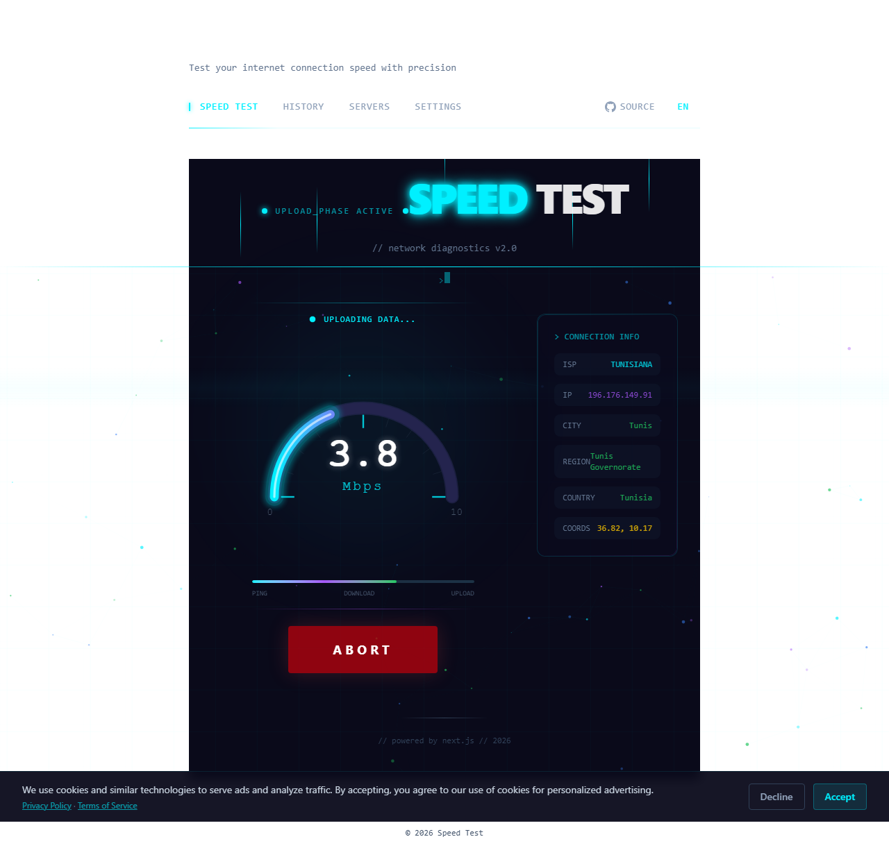
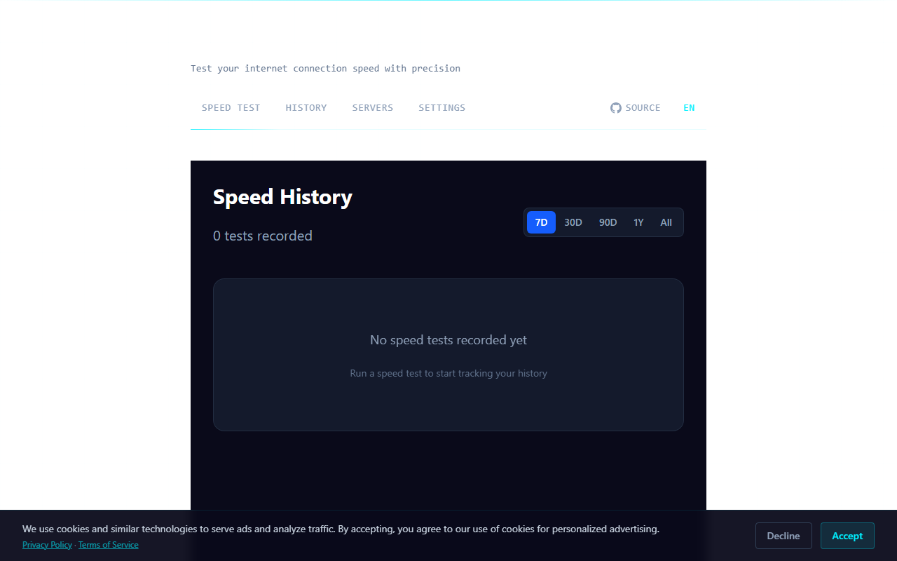
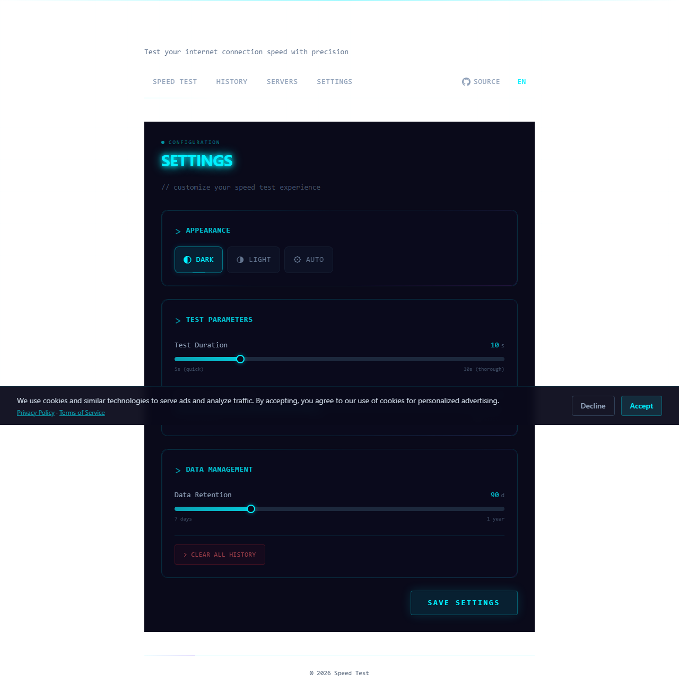
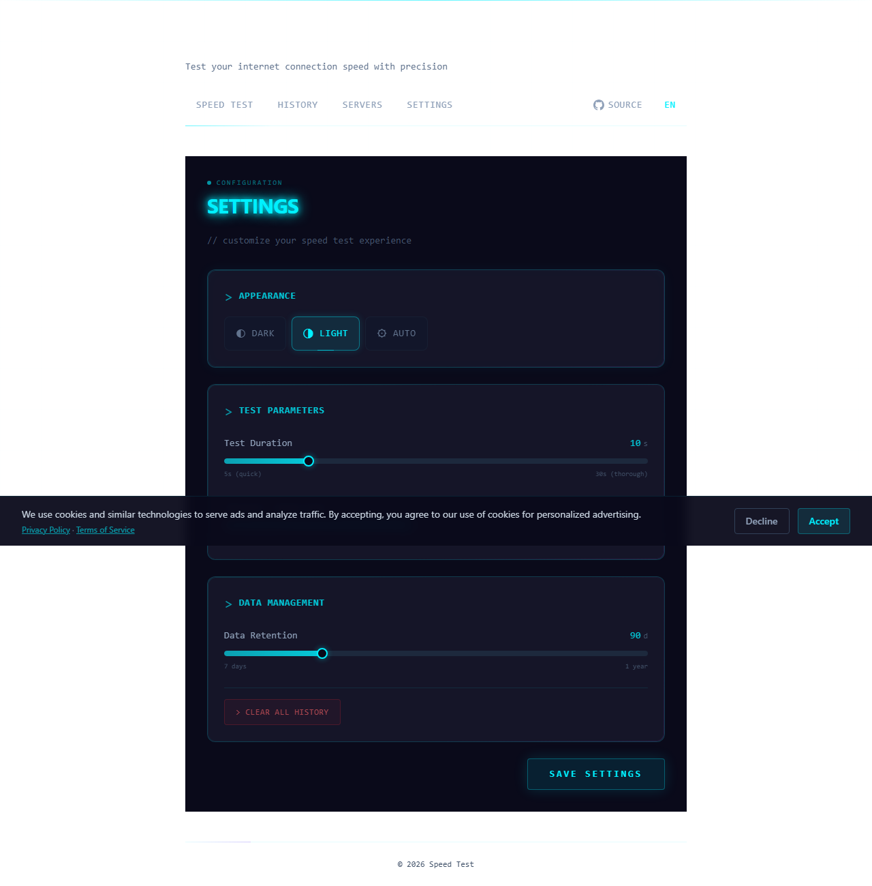
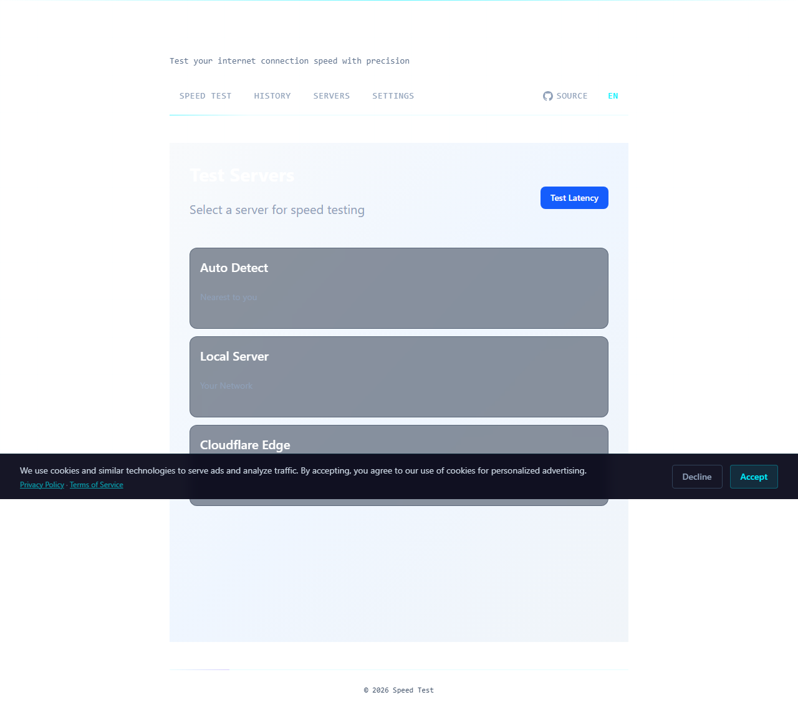
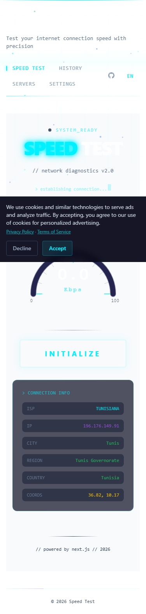
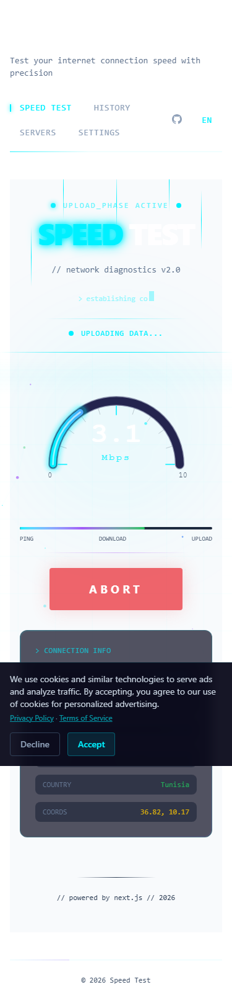
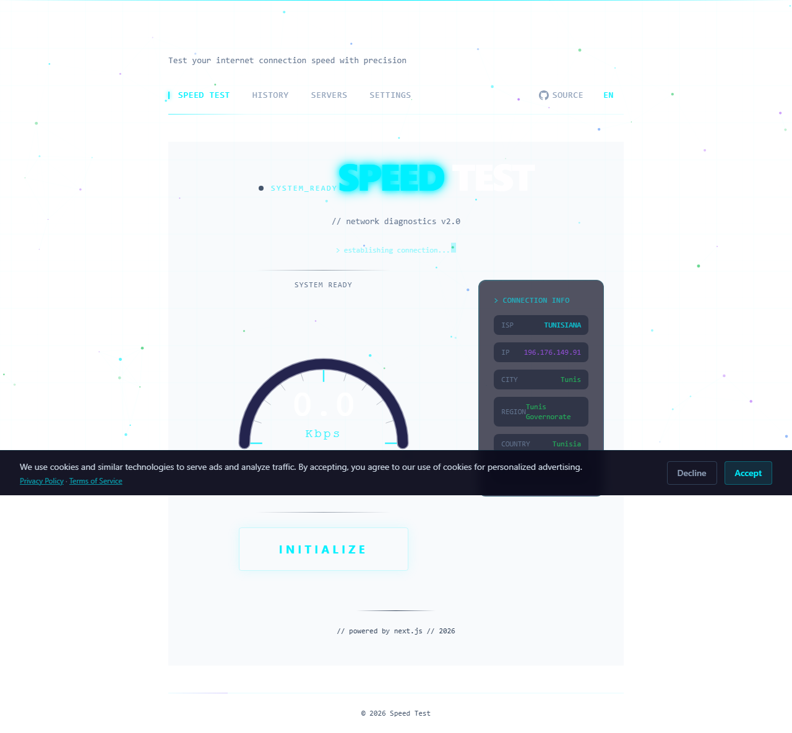
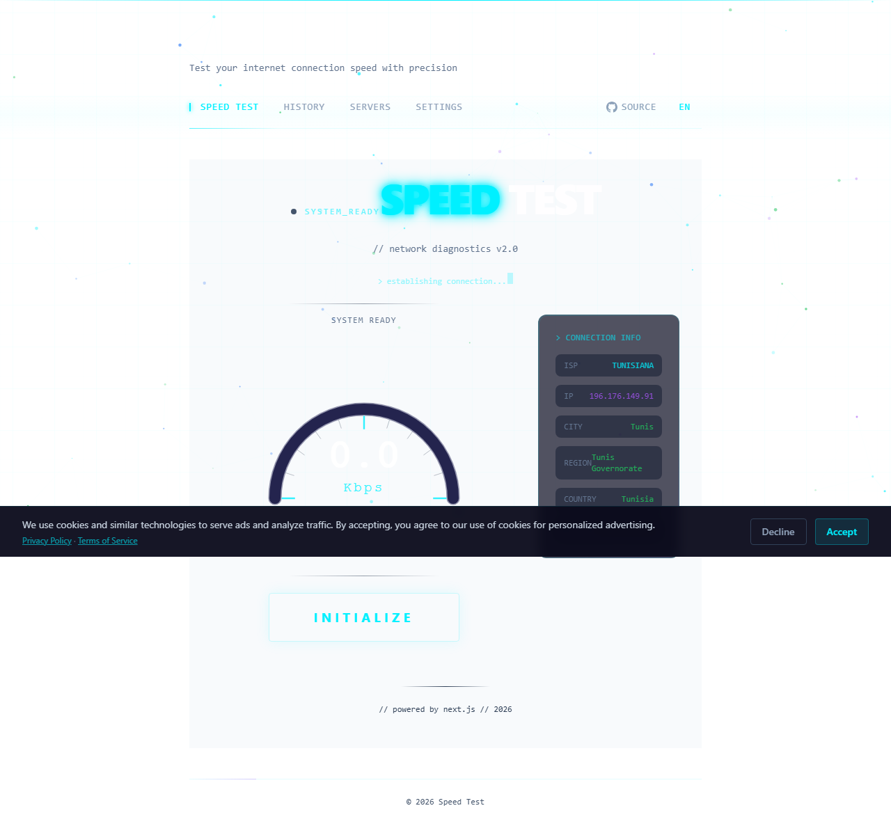

# ⚡ Speed Test

> **Test your internet speed in seconds — free, private, no tracking.**

A modern speed test application with web interface, CLI tools, and MCP server for AI integration.

[](https://speed-test-app-nu.vercel.app)
[](https://github.com/Yac0z/speed-test-app)
[](LICENSE)

---

## 🎯 What Is This?

A fast, beautiful internet speed test that runs in your browser, CLI, or AI assistant. No downloads, no sign-ups, no tracking.

**[→ Try it now](https://speed-test-app-nu.vercel.app)**

---

## 📸 Screenshots

### 🚀 Speed Test - Main Feature

#### Idle State (Ready to Test)


#### Test Running (Real-Time Gauge)


#### Share Results Modal


---

### 📊 Speed History

#### History Overview with Charts


#### Date Filter Dropdown


---

### ⚙️ Settings

#### Settings - Test Parameters


#### Theme Toggle (Dark/Light/System)


---

### 🌍 Server Selection

#### Server List with Latency


---

### 📱 Mobile Experience

#### Mobile - Idle


#### Mobile - Results


#### Mobile - Navigation


---

### 🎨 Theme Variants

#### Dark Mode


#### Light Mode


---

### ℹ️ About Page


---

## ✨ Features

### 🌐 Web App

| Feature | Description |
|---------|-------------|
| 🚀 **Speed Test** | Download, upload, ping & jitter with animated real-time gauge |
| 📊 **Speed History** | Interactive charts with date filtering (7d/30d/90d/1y/all) |
| 📈 **Quality Score** | A-F grade based on download/upload/ping/jitter |
| 🌐 **ISP Detection** | IP, ISP, city, region, country, coordinates |
| 📶 **Connection Type** | Detects 4G/3G/2G, downlink speed, RTT via Network API |
| 📤 **Share Results** | Export as image, copy text, shareable URL, social media |
| 🌍 **Multi-Language** | English and French |
| 🎨 **Themes** | Dark/Light/System mode |
| 🔒 **Privacy-First** | All data stored locally, no tracking |

### 💻 CLI Tool (`packages/cli`)

```bash
speedtest-cli run              # Run a speed test
speedtest-cli run -f json     # JSON output
speedtest-cli run -f csv      # CSV output
speedtest-cli history         # Show saved results
speedtest-cli history -l 20   # Limit to 20 results
speedtest-cli compare         # Compare vs historical average
speedtest-cli compare -l 10   # Compare against last 10 tests
speedtest-cli info            # Show connection info
speedtest-cli monitor         # Continuous monitoring
speedtest-cli monitor -i 60   # Test every 60 seconds
speedtest-cli monitor --alert "download < 50"  # Alert on low speed
```

### 🤖 MCP Server (`packages/server`)

| Tool | Description |
|------|-------------|
| `run_speed_test` | Run tests with configurable duration/phases |
| `get_history` | Retrieve results with limit/days filtering |
| `get_connection_info` | Get IP, ISP, city, region, country |
| `compare_results` | Compare current vs historical average |

---

## 🚀 Quick Start

### Web App
```bash
npm run dev
# Open http://localhost:3000
```

### CLI
```bash
# Build packages
npm run build

# Run CLI
cd packages/cli
npx tsx src/index.ts run

# Or link globally
cd packages/cli
npm link
speedtest-cli run -f json
```

### MCP Server
```bash
# Build
npm run build

# Run server
cd packages/server
npx tsx src/index.ts

# Or use the built version
node packages/server/dist/index.js

# Test with MCP client (e.g., Claude Desktop)
# Add to your MCP config:
{
  "mcpServers": {
    "speedtest": {
      "command": "node",
      "args": ["/path/to/packages/server/dist/index.js"]
    }
  }
}
```

---

## 📊 How Accurate Is It?

| Metric | Method | Accuracy |
|--------|--------|----------|
| **Download** | 6 parallel connections streaming data | ±5% of Ookla |
| **Upload** | 6 parallel uploads with real-time timing | ±5% of Ookla |
| **Ping** | 20 sequential measurements | ±2ms |
| **Jitter** | Mean deviation between pings | ±1ms |

Uses the same methodology as industry-standard tools: parallel connections, TCP warm-up period, and percentile-based calculations.

---

## 🛠️ Built With

| | |
|---|---|
| **Framework** | Next.js 16 (App Router) |
| **UI** | React 19 + Tailwind CSS 4 |
| **Speed Test** | @cloudflare/speedtest |
| **Charts** | lightweight-charts |
| **Database** | PostgreSQL + Drizzle ORM |
| **CLI** | Commander.js + Chalk + Ora |
| **MCP** | @modelcontextprotocol/sdk |
| **Hosting** | Vercel (Edge Network) |

---

## 📁 Project Structure

```
speed-test-app/
├── src/                      # Next.js web app
│   ├── app/                  # App router pages
│   ├── components/           # React components
│   │   ├── speed-test/       # Speed test components
│   │   ├── history/         # History & charts
│   │   ├── settings/        # Settings page
│   │   ├── servers/         # Server selection
│   │   └── share/           # Share modal
│   ├── hooks/                # Custom hooks
│   └── lib/                 # Utilities
├── packages/
│   ├── core/                # Shared speed test engine
│   ├── cli/                 # CLI tool
│   └── server/              # MCP server
├── screenshots/             # App screenshots
└── tests/                   # E2E tests
```

---

## 🌍 Languages

- 🇬🇧 **English**
- 🇫🇷 **French**

Switch languages using the language button in the top-right corner.

---

## 🔐 Privacy

- ✅ **No tracking** — We don't track your browsing
- ✅ **No accounts** — No sign-up required
- ✅ **Local data** — Your speed history stays in your browser
- ✅ **No third-party analytics** — Only Vercel Analytics for page views
- ✅ **Open source** — You can verify everything in the code

---

## 💡 Tips for Best Results

- Close other tabs and apps while testing
- Use a wired connection for most accurate results
- Run multiple tests at different times of day
- Compare results with your ISP's advertised speeds

---

## 🤝 Open Source

This project is open source and free to use. Found a bug or have a suggestion? [Open an issue](https://github.com/Yac0z/speed-test-app/issues) or [contribute](https://github.com/Yac0z/speed-test-app/pulls).

**License:** [MIT](LICENSE)

---

## 📄 Documentation

For developers:
- [Architecture Guide](ARCHITECTURE.md)
- [SEO Setup](SEO.md)
- [Ad Integration](ADS.md)
- [Technical Details](TECHNICAL.md)
- [Performance Report](PERFORMANCE_REPORT.md)

---

Made with ❤️ by [Yacin](https://github.com/Yac0z)