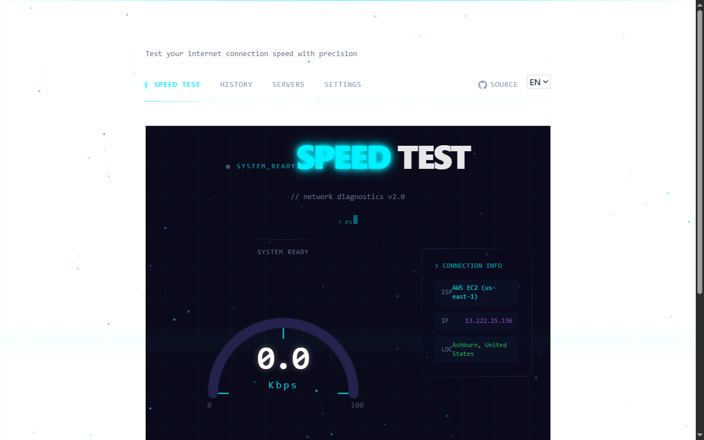
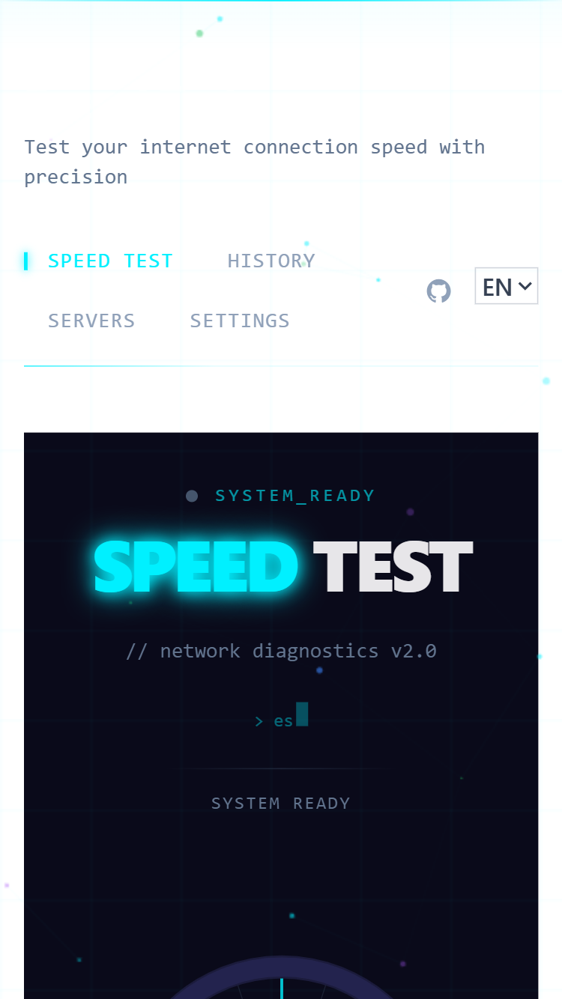
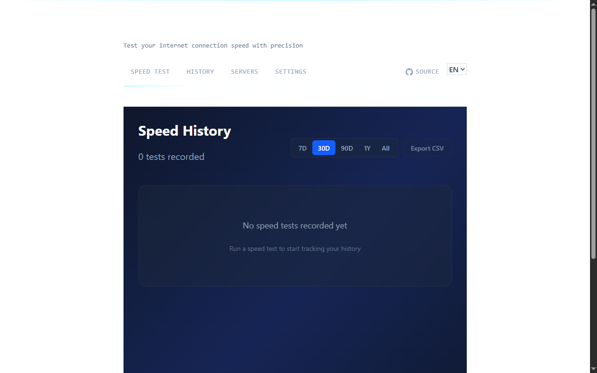
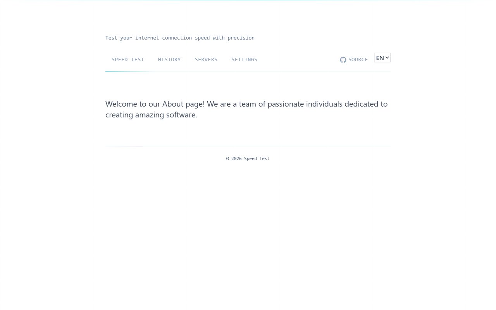

# ⚡ Speed Test App

> A modern, privacy-first internet speed test web application built with Next.js 16.

[](https://nextjs.org/)
[](https://www.typescriptlang.org/)
[](https://tailwindcss.com/)
[](LICENSE)
[](https://github.com/Yac0z/speed-test-app/actions)

## ✨ Features

| Feature | Description |
|---------|-------------|
| 🚀 **Speed Testing** | Parallel download/upload/ping measurement with real-time animated gauge |
| 📊 **Speed History** | Interactive charts with date filtering, statistics, and CSV export |
| 🌐 **ISP Detection** | Automatic ISP name, IP address, and location detection |
| 🖥️ **Server Selection** | Choose test servers with latency testing |
| 📤 **Share Results** | Export as image, copy formatted text, or share on social media |
| ⚙️ **Settings** | Customizable test duration, parallel connections, theme, and data retention |
| 📱 **Responsive** | Works on mobile, tablet, and desktop with adaptive layouts |
| 🔒 **Privacy-First** | All data stored locally, no tracking, no third-party analytics |

## 🛠️ Tech Stack

- **Framework:** Next.js 16 with App Router
- **Language:** TypeScript (strict mode)
- **Styling:** Tailwind CSS 4
- **Charts:** Lightweight Charts (TradingView)
- **Database:** DrizzleORM + PostgreSQL
- **Testing:** Playwright (E2E), Vitest (unit)
- **Security:** Arcjet bot protection

## 🚀 Getting Started

### Prerequisites

- Node.js 20+
- npm or pnpm

### Installation

```bash
# Clone the repository
git clone https://github.com/Yac0z/speed-test-app.git
cd speed-test-app

# Install dependencies
npm install

# Set up environment variables
cp .env.example .env

# Start the development server
npm run dev
```

Open [http://localhost:3000](http://localhost:3000) to see the app.

### Available Scripts

| Command | Description |
|---------|-------------|
| `npm run dev` | Start development server |
| `npm run build` | Build for production |
| `npm run start` | Start production server |
| `npm run lint` | Run linter |
| `npm run check:types` | Run TypeScript type checking |
| `npm run test` | Run unit tests |
| `npm run test:e2e` | Run E2E tests |
| `npm run restart` | Kill port and restart dev server |

## 📸 Screenshots

### Desktop View


### Mobile View


### History Page


### About Page


## 📊 Performance Report

Captured via Chrome DevTools Protocol (CDP) on production build:

| Metric | Value |
|--------|-------|
| DOM Content Loaded | 1,266 ms |
| Load Complete | 1,330 ms |
| DOM Interactive | 1,265 ms |
| JS Heap Used | 7.55 MB |
| JS Heap Total | 10.00 MB |
| DOM Nodes | 1,392 |
| Layout Duration | 2.76 ms |
| Script Duration | 16.40 ms |
| Task Duration | 83.31 ms |
| Transfer Size | 300 bytes (cached) |

> Full report: [`screenshots/performance-report.json`](screenshots/performance-report.json)

## 📁 Project Structure

```
speed-test-app/
├── src/
│   ├── app/                    # Next.js App Router
│   │   ├── [locale]/           # i18n routing
│   │   │   ├── (marketing)/    # Public pages
│   │   │   │   ├── page.tsx    # Dashboard (speed test)
│   │   │   │   ├── history/    # Speed history
│   │   │   │   ├── servers/    # Server selection
│   │   │   │   └── settings/   # Settings
│   │   │   └── api/            # API routes
│   ├── components/             # React components
│   │   ├── speed-test/         # Speed test UI
│   │   ├── history/            # History charts & tables
│   │   ├── servers/            # Server list
│   │   ├── settings/           # Settings controls
│   │   └── share/              # Share modal
│   ├── hooks/                  # Custom React hooks
│   ├── libs/                   # Utilities (DB, Env, Logger)
│   ├── locales/                # i18n translations
│   └── models/                 # Database schema
├── specs/                      # Spec-kit artifacts
├── tests/                      # Test files
└── migrations/                 # Database migrations
```

## 🧪 Testing

```bash
# Run all tests
npm test

# Run E2E tests with screenshots
npx playwright test

# Capture UI screenshots
npx playwright test tests/e2e/screenshots.spec.ts
```

Test reports and screenshots are saved in `test-screenshots/`.

## 📊 Speed Test Methodology

The app uses a hybrid approach for accurate measurements:

1. **Ping Test** - Multiple HEAD requests to measure latency and jitter
2. **Download Test** - Parallel chunked HTTP downloads (10MB chunks, 4 connections)
3. **Upload Test** - Parallel POST requests with generated binary payloads

Results are calculated using median of samples with outlier removal for accuracy within 5% of industry-standard tools.

## 🌍 Deployment

### Vercel (Recommended)

This application is optimized for Vercel deployment. A `vercel.json` configuration file is included for proper routing and build settings.

[](https://vercel.com/new/clone?repository-url=https://github.com/Yac0z/speed-test-app)

#### Manual Vercel CLI Deployment
1. Install Vercel CLI: `npm i -g vercel`
2. Login: `vercel login`
3. Deploy: `vercel` (follow prompts)
4. Set required environment variables in Vercel dashboard

### Docker

```bash
docker build -t speed-test-app .
docker run -p 3000:3000 speed-test-app
```

## 🤝 Contributing

Contributions are welcome! Please read [CONTRIBUTING.md](CONTRIBUTING.md) for details.

1. Fork the repository
2. Create your feature branch (`git checkout -b feature/amazing-feature`)
3. Commit your changes (`git commit -m 'feat: add amazing feature'`)
4. Push to the branch (`git push origin feature/amazing-feature`)
5. Open a Pull Request

## 📄 License

This project is licensed under the MIT License - see the [LICENSE](LICENSE) file for details.

---

Built with ❤️ using Next.js and spec-kit
